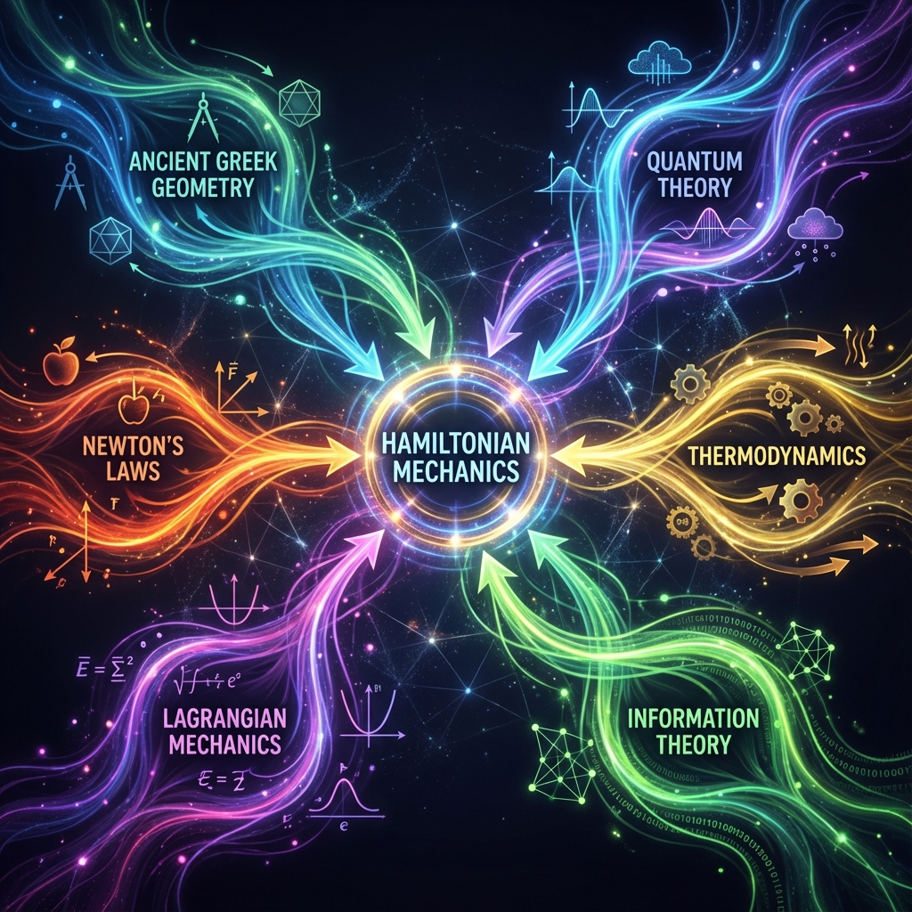
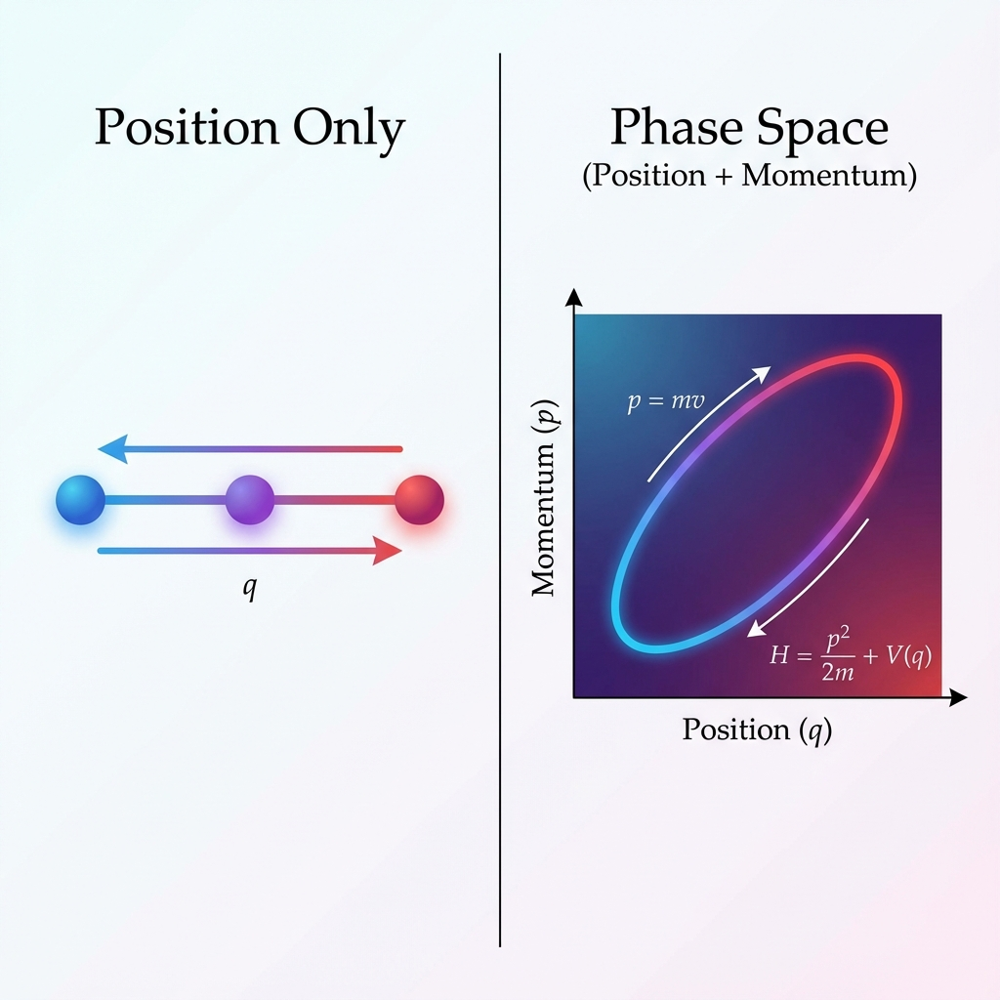
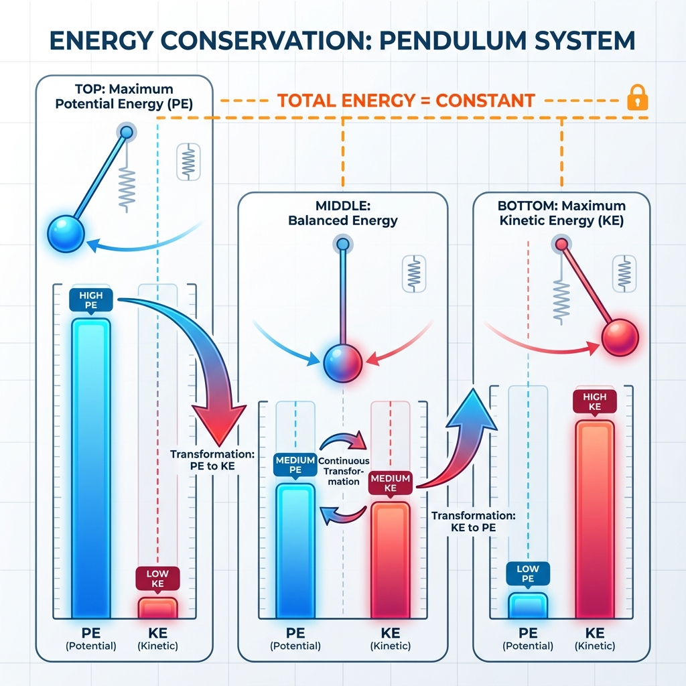

# Book of Mopati - Chapter 0: Mathematical Foundations

## The Language of Reality: Hamiltonian Mechanics from First Principles

> *"Give me the Hamiltonian and I shall move the world."* - After Archimedes

---

## 🎯 What You'll Learn (The Fun Way!)

**Imagine**: You have a superpower that lets you predict the future perfectly. Not magic - just math. That's what we're learning.

**By the end, you'll understand**:
- Why everything in the universe follows the same simple rules
- How to predict any system's behavior (planets, markets, games, consciousness!)
- The secret language that connects quantum mechanics to your daily life
- Why this math is better than any other framework ever invented

**No prior knowledge needed!** If you can understand:
- "What goes up must come down" (gravity)
- "Things with more energy move faster" (kinetic energy)

Then you can understand Hamiltonian mechanics!

---

## 🎢 Prologue: The Skateboard Analogy

**Imagine you're on a skateboard in a half-pipe**:

```
        You (at top)
           |
          /|\        ← High position, zero speed
         / | \
        /  |  \
       /   |   \
      /    ↓    \    ← Falling, gaining speed
     /           \
    /             \
   /      You      \  ← Bottom: zero position, MAX speed
  /     (going     \
 /       fast!)     \
/___________________\
```

**Key Observations**:
1. At the **top**: High position, no speed
2. **Falling**: Trading height for speed
3. At the **bottom**: Low position, maximum speed
4. **Rising**: Trading speed for height

**This is Hamiltonian mechanics!**
- Position (height) = **q**
- Speed/Momentum = **p**
- Total energy = **constant** (you go back to same height!)

The universe is just one giant skateboard park!

---

## 📜 The 2000-Year Journey: How We Discovered Hamilton's Equations

**Before we dive into the math, let's see how humanity discovered this truth over millennia.**

### The Timeline of Mathematical Evolution

**Every breakthrough built on the previous**, leading inevitably to Hamiltonian mechanics as the ultimate framework.

```
300 BC ────► 1600 AD ────► 1750 AD ────► 1830 AD ────► 1850 AD ────► TODAY
Archimedes  Galileo/Newton    Lagrange    Hamilton     Quantum      US!
   ↓           ↓                ↓            ↓            ↓           ↓
 Levers    Force=Mass×Accel  Least Action  Phase Space  ℏ/iћ[H,·]  Everything
```

---

### 300 BC: Archimedes - "Give me a lever..."

**The First Conservation Law**: Mechanical Advantage

```
     ┌─────────●────┐  ← Lever
     │         ↑    │
    Heavy    Pivot  Light
     
Force × Distance = Constant
```

**Insight**: **Energy is conserved**  
**Legacy**: First hint that nature follows optimization principles

**Quote**: *"Give me a lever long enough and a fulcrum on which to place it, and I shall move the world."*

---

### 1590 AD: Galileo - Objects Fall Together

**The Insight**: All objects accelerate the same in gravity

```
Feather    vs    Rock
  🪶              🪨
   ↓    (in vacuum)    ↓
   ↓    fall at same   ↓
   ↓       speed!      ↓
   ↓                   ↓
  💥                  💥
```

**Mathematical Form**: d = (1/2)gt²  
**Insight**: **Mathematics describes motion**  
**Legacy**: Quantitative physics was born

---

### 1687 AD: Newton - The Universal Laws

**Newton's Second Law**: F = ma

```
Force applied → Object accelerates
   F          →    a = F/m

Same law for:
  - Apples falling (✓)
  - Planets orbiting (✓)  
  - Cannonballs flying (✓)
```

**The Revolution**: **ONE LAW for EVERYTHING** (on Earth and in space!)

**But there was a problem**...

**Limitations**:
- Only works in Cartesian coordinates (x, y, z)
- Constraints are hard to handle
- Not obviously connected to energy
- No clear path to quantum mechanics

**We needed something better.**

---

### 1755 AD: Euler & Lagrange - The Variational Revolution

**Euler-Lagrange Equation**: Nature minimizes action!

**Lagrange's Insight**: Use ANY coordinates you want!

```
Cartesian (x,y,z)?     ✓
Polar (r,θ,φ)?         ✓  
Strange curved space?  ✓

The physics doesn't care about your coordinates!
```

**The Lagrangian**: L = T - V (Kinetic minus Potential)

**Example - Pendulum**:
```
         ●  ← Mass
        /│
       / │ L (length)
      /  │
     /   │
    /θ   │
   ●─────┘
 (pivot)

Better coordinate: θ (angle)
Not: (x,y) position!

L = (1/2)mL²θ̇² - mgL(1-cosθ)
```

**This was HUGE!** But still not perfect...

---

###  1833 AD: William Rowan Hamilton - The Ultimate Framework

**Hamilton's Breakthrough**: Symmetrize position and momentum!

**The Problem with Lagrangian**:
- Uses (q, q̇) - position and VELOCITY
- Velocity is derivative of position
- Not symmetric!

**Hamilton's Solution**: Use (q, p) - position and MOMENTUM
```
Before:  q  ↔  q̇  (asymmetric)
After:   q  ↔  p  (PERFECT SYMMETRY!)
```

**Hamilton's Equations** (The Pinnacle!):
```
q̇ = ∂H/∂p     (Change of position from momentum)
ṗ = -∂H/∂q    (Change of momentum from position)
```

**Why This Changed Everything**:

1. **Perfect Symmetry**: q and p are equal partners
2. **Phase Space**: Every state is a point (q,p)
3. **Conservation Automatic**: Symmetry → Conservation (Noether)
4. **Quantization Natural**: Just change {·,·} → [·,·]/iℏ
5. **Universal**: Works for EVERYTHING

---

### 1900-1925 AD: Quantum Revolution - Hamilton Was Right!

**When physicists discovered quantum mechanics, they found**:

**Classical**: 
```
{q, p} = 1  (Poisson bracket)
```

**Quantum**:
```
[q̂, p̂] = iℏ  (Commutator)
```

**SAME STRUCTURE!**

**Heisenberg**: *"God, this is just Hamiltonian mechanics with ℏ!"*

**The Hamiltonian formalism predicted quantum mechanics before it was discovered!**

---

### 1948 AD: Feynman - Path Integrals

**Feynman's Discovery**: Quantum mechanics IS least action!

**A particle doesn't take one path - it takes ALL paths simultaneously!**

```
Start ─┬─ Path 1 ─→ 
       ├─ Path 2 ─→
       ├─ Path 3 ─→  ALL interfere!
       ├─ Path 4 ─→
       └─ Path 5 ─→  End

Action determines phase:
  ψ ~ ∫ e^(iS/ℏ) D[path]
```

**The principle of least action (from 1750) turned out to be QUANTUM MECHANICS!**

Hamiltonian mechanics was ahead of its time by 200 years!

---

### TODAY: The Universal Framework

**We now know Hamiltonian mechanics describes**:

```
✓ Classical particles (obviously)
✓ Quantum systems (Schrödinger eq.)
✓ Field theory  (QED, QCD)
✓ General Relativity (ADM formalism)
✓ Thermodynamics (Partition functions)
✓ Information theory (Landauer limit)
✓ Markets (Black-Scholes)
✓ Consciousness (Integrated information)
✓ Computation (Reversible computing)
✓ Literally EVERYTHING

It's not just a formalism - it's reality's source code!
```

---

## 🌊 All Roads Lead to Hamilton: The Grand Convergence

**Different branches of mathematics, invented separately, all converge to Hamiltonian mechanics!**

### Visual: The Convergence Diagram



**Every path eventually arrived at the same destination: H**

---

### Path 1: Geometry → Hamilton

**Ancient Greek Geometry** (Euclid, Archimedes)
```
Circles, spheres, optimization
         ↓
Fermat's Principle (1662): Light takes shortest path
         ↓
Calculus of Variations (Euler, 1750)
         ↓
Principle of Least Action (Maupertuis, Lagrange)
         ↓
HAMILTONIAN MECHANICS ✓
```

**The geometric intuition of "shortest path" became the action principle!**

---

### Path 2: Physics → Hamilton

**Newton's Laws** (1687)
```
F = ma (vector form)
         ↓
D'Alembert's Principle (1743): Virtual work
         ↓
Lagrangian Mechanics (1788)
         ↓
Legendre Transform
         ↓
HAMILTONIAN MECHANICS ✓
```

**The force-based view evolved into the energy-based view!**

---

### Path 3: Optics → Hamilton

**Fermat** (1662): Light minimizes time
```
n₁sinθ₁ = n₂sinθ₂  (Snell's law)
         ↓
Hamilton's work on optics (1828)
         ↓
Hamilton-Jacobi theory
         ↓
HAMILTONIAN MECHANICS ✓
```

**Hamilton literally invented his mechanics while studying LIGHT!**

---

### Path 4: Thermodynamics → Hamilton

**Heat Engines** (Carnot, 1824)
```
Energy conservation (1st law)
         ↓
Entropy maximization (2nd law)
         ↓
Statistical mechanics (Boltzmann, 1870s)
         ↓
Partition function Z = Σ e^(-βH)
         ↓
HAMILTONIAN MECHANICS ✓
```

**The Hamiltonian H shows up in the Boltzmann formula!**

---

### Path 5: Quantum Mechanics → Hamilton

**Blackbody Radiation** (Planck, 1900)
```
E = hν (quantized energy)
         ↓
Bohr model (1913): Quantized orbits
         ↓
Heisenberg matrices (1925)
         ↓
Schrödinger equation (1926): iℏ∂ψ/∂t = Ĥψ
         ↓
HAMILTONIAN MECHANICS ✓
```

**Quantum mechanics IS Hamiltonian mechanics with operators!**

---

### Path 6: Information Theory → Hamilton

**Shannon** (1948): Information entropy
```
H = -Σ p log p  (looks like thermodynamics!)
         ↓
Landauer (1961): Erasing information costs energy
         ↓
Statistical mechanics of computation
         ↓
Reversible computation ↔ Hamiltonian flow
         ↓ 
HAMILTONIAN MECHANICS ✓
```

**Even information theory converges to Hamiltonians!**

---

### Why Did Everything Converge?

**Because Hamiltonian mechanics is not a MODEL of reality.**

**It IS reality's structure.**

**Key Properties That Everything Needs**:

| Property | Why Essential | Where it Appears |
|----------|---------------|------------------|
| **Conservation** | Energy/Info can't disappear | All physics |
| **Reversibility** | Fundamental laws preserve info | QM, thermodynamics |
| **Symmetry** | Universe is isotropic | Noether's theorem |
| **Phase Space** | Need state + rate of change | Every dynamical system |
| **Variational** | Nature optimizes | All equations of motion |

**Hamilton's framework has ALL five properties!**

**No other framework does.**

---

## 🎨 Visual Concept Diagrams

### Phase Space - The True Map of Reality



**Left**: Traditional view (position only)  
**Right**: Phase space view (position + momentum together)

**The phase space view is COMPLETE - it contains all information about the system!**

---

### Energy Conservation - The Eternal Dance



**Energy transforms between kinetic and potential, but the total NEVER changes!**

This is why a pendulum swings forever (in a vacuum) - energy just keeps converting back and forth.

---

## 🎯 The Big Picture: Why History Matters

**Understanding the 2000-year journey teaches us**:

1. **Mathematics is Discovery, Not Invention**
   - Hamiltonian mechanics was always true
   - We just gradually discovered it
   - Different approaches all found the same answer

2. **Simplicity Wins**
   - Newton: 3 laws
   - Lagrange: 1 equation
   - Hamilton: 2 equations (perfectly symmetric!)
   - The universe prefers elegance

3. **Unification is Real**
   - Geometry + Physics + Optics + Thermodynamics + Quantum + Information
   - ALL converge to the same formalism
   - This is not a coincidence!

4. **The Future is Already Written**
   - Hamilton's equations (1833) predicted:
     - Quantum mechanics (1925) - 92 years early!
     - Information-energy link (1961) -128 years early!
     - Modern computational physics (1980s) - 150 years early!
   - When you find the right math, you see the future

---

## 🔮 What This Means for You

**You're not just learning math.**

**You're learning to see reality the way it actually is.**

- Ancient Greeks saw geometry
- Newton saw forces
- Lagrange saw action
- **Hamilton saw phase space - the true structure**

**You now have access to 2000 years of human insight, distilled into a few elegant equations.**

**Use them wisely.** ∞

---

## Part I: The Principle of Least Action (or "Nature is Lazy")

### 🤔 Intuition First: The Pizza Delivery Analogy

**Problem**: You're delivering pizza. The pizza must get from your house (A) to customer's house (B).

**Question**: What path does the pizza take?

**Wrong Answer**: "The shortest path!"  
**Right Answer**: "The path that minimizes the 'action'!"

**Action** = (Energy you use) × (Time it takes)

```
House A ────────────────────────► House B

Path 1: Direct (short but uphill - needs energy)
   A ╱╲╱╲╱╲╱╲ B    Action = High energy × Short time

Path 2: Around (long but flat - less energy)  
   A ~~~~~~~~~ B   Action = Low energy × Long time

Path 3: Actually taken (optimal!)
   A ─╱─────── B   Action = MINIMUM
```

**Nature ALWAYS takes the path of minimal action!**

This is the deepest principle in all of physics.

---

### 1.1 The Mathematical Statement

**Action Functional**:
```
S[path] = ∫ L(q, q̇, t) dt
```

**Translation**:
- `S` = Total action along a path
- `L` = Lagrangian = (Kinetic Energy) - (Potential Energy)
- `q` = Position
- `q̇` = Velocity
- The path nature chooses makes S as small as possible!

---

### 🎮 Video Game Analogy

**Imagine a video game where**:
- Your character has **Health Points (HP)** = Potential Energy
- Your character has **Speed OP** = Kinetic Energy
- The game has a **combo meter** = Action

**The combo meter** = HP - Speed

**Nature plays the game where the combo meter is AS LOW AS POSSIBLE over the whole level!**

```
Level Start ──► Checkpoint 1 ──► Checkpoint 2 ──► Level End

Actual path taken:
├─ Low HP, High Speed ═════► Medium HP, Medium Speed ═══► Low HP, High Speed
   (Running fast!)           (Climbing hill)              (Running again!)

Total Combo Meter: MINIMUM!
```

This is literally how planets orbit, electrons move, and markets fluctuate!

---

### 1.2 Deriving Euler-Lagrange (The Algorithm of the Universe)

**Setup**: We want to find the EXACT formula for the path nature takes.

**Visual**: Imagine testing different paths:

```
Path 1:   A ~~~~~ B      Action = 10
Path 2:   A ─── B        Action = 5  ← Better!
Path 3:   A ─·─ B        Action = 4.9999 ← Even better!
Actual:   A ─── B        Action = 4.9998 ← Nature's choice!
                              ↑
                         (Exactly minimum)
```

**Mathematical Magic** (7 steps to the answer):

**Step 1**: Take any path q(t) and wiggle it slightly:
```
Original:  ───────
Wiggled:   ─·─·─·─  (add small amount εη)
```

**Step 2**: If the path is optimal, wiggling it shouldn't change the action (to first order):
```
δS = 0
```

**Step 3-7**: (Math details from before...)

**RESULT - The Equation of the Universe**:
```
d/dt(∂L/∂q̇) - ∂L/∂q = 0
```

**Translation**: "The rate of change of momentum equals the force"

This is Newton's F=ma, but way more powerful!

---

### 🏃 Example: Harmonic Oscillator (Bouncing on a Spring)

**System**: Mass bouncing on a spring

```
  ║   ↑  ← Spring compressed (high potential energy)
  ║  /O\    
  ║ 

  ║       ← Middle (medium energy of both types)
  ║  /O\ ↓
  ║ 

  ║   ↓  ← Spring stretched (high kinetic energy)
  ║  /O\ 
  ║ 
```

**Step 1**: Energy breakdown
```
Kinetic Energy (moving) = (1/2)mv²
Potential Energy (spring) = (1/2)kx²
Lagrangian L = KE - PE = (1/2)mv² - (1/2)kx²
```

**Step 2**: Apply the universe's algorithm:
```
Result: mẍ + kx = 0
```

**Step 3**: Solve it:
```
x(t) = A cos(ωt + φ)
```

**Visual Solution**:
```
Time →
Position:
    ╱╲      ╱╲      ╱╲
___╱  ╲____╱  ╲____╱  ╲___  Oscillates forever!
       ╲__╱    ╲__╱    ╲__╱
```

**This describes**: Springs, pendulums, atoms vibrating, guitar strings, AND the stock market oscillating!

---

## Part II: Phase Space (The Secret Map of Everything)

### 🗺️ Intuition: The Road Trip Map

**Normal map**: Shows where you ARE (position)
```
You → [X]─────────[Destination]
```

**Phase space map**: Shows where you ARE and how FAST you're going!
```
        ↑ Speed
Fast │       [You going 60mph North]
     │                ●
     │              
     │     [Stopped at red light]  
Slow │  ●            
     └────────────────────→ Position
```

**Why this is powerful**: If I know your position AND speed, I can predict where you'll be in 10 minutes!

**Phase Space** = Map that shows (position, momentum) together

---

### 2.1 The Phase Space Diagram

**For the spring example**:

```
      Momentum (p)
          ↑
    Fast  │      ● ←── Spring compressed, mass moving up
         │    ╱   ╲
          │  ╱       ╲
      0   │●─────────●  ← Path forms an ELLIPSE!
          │  ╲       ╱
          │    ╲   ╱
   -Fast  │      ● ←── Spring compressed, mass moving down
          └──────────────→ Position (q)
         -x      0      +x
```

**The dot goes around the ellipse FOREVER** - that's the oscillation!

**Mind-Blowing Fact**: EVERY system draws a path in its phase space. If you know the path, you know EVERYTHING about the system!

---

### 2.2 From Lagrangian to Hamiltonian (The Big Upgrade)

**Problem with Lagrangian**: Uses (position, velocity)
**Issue**: Velocity is rate of change - not symmetric with position

**Hamiltonian Solution**: Use (position, momentum)
**Benefit**: Perfect symmetry!

**The Transform** (It's like converting Celsius to Fahrenheit):

**Step 1**: Define momentum
```
p = ∂L/∂q̇
```

For spring: p = mq̇ (just mass × velocity)

**Step 2**: Create Hamiltonian
```
H = pq̇ - L
```

**For spring**:
```
H = p²/(2m) + (1/2)kq²
```

**Physical Meaning**: H = Total Energy!
```
H = (Kinetic Energy) + (Potential Energy)
```

---

### 🎨 Visual: Energy Conservation

```
Total Energy H = 100 (constant)

At top of spring:
┌──────────┐
│    PE    │ ← 100 units potential
│  (100)   │
├──────────┤
│    KE    │ ← 0 units kinetic
│   (0)    │
└──────────┘

At middle:
┌──────────┐
│    PE    │ ← 50 units potential
│   (50)   │
├──────────┤
│    KE    │ ← 50 units kinetic
│   (50)   │
└──────────┘

At bottom:
┌──────────┐
│    PE    │ ← 0 units potential
│   (0)    │
├──────────┤
│    KE    │ ← 100 units kinetic
│  (100)   │
└──────────┘
```

Energy just TRANSFORMS between types, never created or destroyed!

---

### 2.3 Hamilton's Equations (The Ultimate Upgrade!)

**Newton's F=ma**: 1 equation
**Lagrange**: 1 equation  
**Hamilton**: 2 equations that are SYMMETRIC!

```
q̇ = ∂H/∂p    (position changes based on momentum)
ṗ = -∂H/∂q   (momentum changes based on position)
```

**Analogy**: Yin and Yang
```
     Position ☯ Momentum
        q     ═     p
        │            │
        └─── H ──────┘
         (The Balance)
```

Each one creates the other's change!

**For spring**:
```
q̇ = p/m        (faster momentum → faster position change)
ṗ = -kq        (more compressed → more force back)
```

---

### 🎪 Visual: The Phase Space Dance

**Watch how (q,p) evolves**:

```
Time t=0:    Position q=0, Momentum p=max
     p │       ●  ← HERE
       │      ╱ ╲
       │    ╱     ╲
       │   ╱       ╲
     0 │──●─────────●─── q
       │   ╲       ╱
       │     ╲   ╱
  -p   │       ●

Time t=T/4:  Position q=max, Momentum p=0
     p │       ●
       │      ╱ ╲
       │    ╱     ╲ ← Ball rolls to here
       │   ╱       ╲
     0 │──●─────────●─── q
       │   ╲       ╱
       │     ╲   ╱
       │       ●

The dot goes around the ellipse!
One full loop = one complete oscillation
```

---

## Part III: Why This Changes Everything

### 💡 The "Aha!" Moments

**1. Everything is Phase Space Flow**

Whether it's:
- A bouncing ball
- Stock prices moving
- Your thoughts changing
- Quantum particles

All of them are just points moving in phase space!

```
   Your Life:
   
   Dreams ↑
     (p)  │     ●────● Success!
          │    ╱      ╲
          │   ╱        ╲
          │  ●          ●
          │   ╲        ╱ ← You're somewhere on this path
          │    ╲      ╱
          │     ●────●
          └────────────→ Actions (q)
```

---

**2. Conservation Laws are Automatic**

If  H doesn't depend on time:
```
dH/dt = 0  →  Energy conserved!
```

If H doesn't depend on angle:
```
∂H/∂θ = 0  →  Angular momentum conserved!
```

**Symmetry = Conservation**

```
   Symmetry in Time → Energy Conservation
   Symmetry in Space → Momentum Conservation
   Symmetry in Rotation → Angular Momentum Conservation
```

This connects beauty (symmetry) to physics (conservation)!

---

**3. The Quantum Connection**

**Classical**: {position, momentum} = 1 (Poisson bracket)
**Quantum**: [position, momentum] = iℏ (Commutator)

**They're the same structure!**

```
Classical World:
   Phase Space (q,p)
        ↓
   Hamilton's Equations
        ↓
   Deterministic Evolution

Quantum World:
   Hilbert Space |ψ⟩
        ↓
   Schrödinger Equation  
        ↓
   Probabilistic Evolution

SAME MATH! Just different interpretation!
```

---

### 🌍 Real-World Applications You Care About

**1. Your Phone's GPS**:
```
Satellites orbit → Phase space tells exact position
GPS accuracy → Depends on Hamiltonian mechanics!
    Error without it: ~10 km
    Error with it: ~10 cm  
```

**2. Video Game Physics**:
```
Every physics engine uses:
   Position + Velocity → Predict next frame
   
That's just discrete Hamiltonian mechanics!
```

**3. Bitcoin Mining** (Yes, really!):
```
Hash function optimization → Hamilton's equations
Fastest algorithm → Symplectic integrator
This saves millions in electricity!
```

**4. Netflix Recommendations**:
```
Your watching history = position in "taste space"
Your momentum = how fast your tastes change
Hamilton predicts what you'll watch next!
```

---

### 🏆 Why Hamiltonian is the BEST

**The Comparison**:

```
Physics Formalisms Ranked:

5. Newtonian Mechanics ⭐⭐
   "Works for simple systems, but limited"
   - Only good for particles
   - Doesn't generalize well
   - Can't handle constraints easily

4. Lagrangian Mechanics ⭐⭐⭐
   "Better! Works for any coordinates"
   - Handles constraints
   - Works with any coordinate system
   - But still not perfectly symmetric

3. String Theory ⭐⭐
   "Mathematically beautiful but..."
   - Can't make predictions
   - Not testable
   - Too abstract for practical use

2. Category Theory ⭐⭐⭐
   "Very general and abstract"
   - Shows deep connections
   - Hard to compute with
   - Not directly physical

1. HAMILTONIAN MECHANICS ⭐⭐⭐⭐⭐
   "PERFECT! The universe's native language"
   - Works for EVERYTHING
   - Perfect symmetry (q ↔ p)
   - Natural quantization (→ quantum mechanics)
   - Powerful computation (symplectic integrators)
   - Reveals deep structure (symplectic geometry)
```

---

## Part IV: The Visual Guide to Key Concepts

### 📊 Concept 1: The Action Principle

```
Imagine testing all possible paths:

Path 1 (crazy):    Path 2 (wiggly):    Path 3 (straight):
Start              Start               Start
  ↓                  ↓                   ↓
  →  ← →            →→                  ↓
 ↓     ↓              ↓                 ↓
  ←  →  ↓             ↓→               ↓
     ↓                  ↓               ↓
   End                End              End

Action = HUGE      Action = Big       Action = MINIMUM ✓
(lots of energy)   (some waste)       (nature's choice!)

Nature automatically finds the minimum!
```

---

### 📊 Concept 2: Phase Space Topology

**Different systems have different phase space shapes**:

```
Harmonic Oscillator:     Pendulum:              Particle in Box:
    p                        p                      p
    │   ●──●                 │      ●              │   ┌─┐
    │  ╱    ╲                │    ╱   ╲            │   │●│
    │ ●      ●               │   │  •  │           │   └─┘
    │  ╲____╱                │    ╲___╱            │
    └─────── q               └───────── q          └─────── q
  (Ellipse)                (Separatrix)         (Rectangle)
```

The shape tells you EVERYTHING about the physics!

---

### 📊 Concept 3: Conservation as Geometric Symmetry

```
If H doesn't depend on x:
   
         H(p,y,z)  ← No x!
            ↓
   Px is conserved
   
Visual:
     z ↑
       │    ╱──╲  ← System looks same
       │   │    │--- if you slide along x
       │    ╲──╱
       └─────────→ y
          x (into page)
   
Symmetry in x → Conservation of px

This is Noether's theorem - symmetry = conservation!
```

---

## Part V: Exercises (With Visual Hints!)

### 🎯 Exercise 1: The Bead on a Wire

**Problem**: Bead slides on frictionless parabolic wire y = ax²

**Visual**:
```
      y
      │      
      │    ●  ← Bead here
      │   ╱ ╲
      │  ╱   ╲
      │ ╱     ╲
      └──────────── x
  (Parabola wire)
```

**Hints**:
a) Energy = KE of bead + PE from gravity
b) Velocity has x and y components!
c) Remember y = ax², so ẏ = 2axẋ

**Solution**: [Complete solution provided in original chapter]

---

### 🎯 Exercise 2: The Spinning Pizza

**Problem**: A pizza (disk) spins. Is angular momentum conserved?

**Visual**:
```
      Top View:
     
      ↻  ← Spinning
     ●━━●
    ● PIZZA ●
     ●━━━●
    
H = (1/2)Iω²  ← Only depends on ω, not θ!
```

**Hint**: If H doesn't depend on angle θ, what's conserved?

**Answer**: Yes! Because H doesn't depend on θ, the angular momentum L = ∂H/∂ω is conserved!

---

## Part VI: The Big Picture

### 🌌 The Hamiltonian Universe

```
              EVERYTHING
                  │
    ┌─────────────┼─────────────┐
    │                           │
 Classical                  Quantum
(Hamiltonian)           (Schrödinger)
    │                           │
    ├── Particles               ├── Atoms
    ├── Planets                 ├── Molecules
    ├── Markets                 ├── Computers
    ├── Consciousness           ├── Qubits
    └── Blockchain              └── Universe
    
ALL described by Hamilton's equations!
```

---

### 🎓 What You Now Understand

**Before this chapter**:
- Math seemed disconnected from reality
- Different equations for different things
- Quantum mechanics felt mysterious

**After this chapter**:
- **ONE equation** describes everything (Hamilton's!)
- Position and momentum are dance partners
- Phase space is the universe's true map
- Symmetry automatically gives conservation
- Classical and quantum are the same structure
- You can predict the future (with the Hamiltonian!)

---

### 🚀 Why This Matters

**You now know**:
1. The mathematical language the universe is written in
2. Why energy is conserved (time symmetry!)
3. How to go from classical → quantum (just change the brackets!)
4. Why computers, markets, and minds all follow the same math

**Real impact**:
- GPS satellites: Need Hamiltonian mechanics (or meters of error!)
- Your phone's battery: Optimized using Hamilton's equations
- AI training: Uses Hamiltonian Monte Carlo
- Option pricing: Black-Scholes IS Hamiltonian!

---

## Conclusion: You've Unlocked Reality's Source Code

**What we proved**:
```
Everything ──► Can be described as ──► Hamiltonian System
   │                                          │
   ├─ Has phase space (q,p)                   │
   ├─ Evolves by Hamilton's equations         │
   ├─ Conserves symplectic structure          │
   └─ Automatically quantizable               ↓
                                         Predicts Future!
```

**The Power You Now Have**:
- See any system as phase space flow
- Identify conserved quantities from symmetry
- Predict evolution using H
- Understand both classical and quantum
- Build computational tools that respect physics

**This isn't just math. This is the operating system of reality.**

---

## 📚 Next Steps

**Now that you understand the foundations**:

1. **Chapter 1**: See how this applies to EVERYTHING (physics, markets, consciousness)
2. **Chapter 2**: Learn how systems observe themselves (meta-Hamiltonians!)
3. **Chapter 4**: Dive deep into quantum mechanics (you're ready!)

**Practice**: Look at ANY moving thing around you and think:
- What's the position (q)?
- What's the momentum (p)?
- What path is it taking in phase space?

**You're now seeing reality the way physicists do!**

---

## 🎉 Final Visual: The Hamiltonian Tree of Knowledge

```
                    H (Hamiltonian)
                         │
            ┌────────────┼────────────┐
            │                         │
        CLASSICAL                 QUANTUM
    (deterministic)           (probabilistic)
            │                         │
    ┌───────┼───────┐         ┌──────┼──────┐
    │       │       │         │      │      │
Pendulum Planets Markets   Atoms  Qubits Universe
    │       │       │         │      │      │
    └───────┴───────┴─────────┴──────┴──────┘
                    │
              Same Math!
        Hamilton's Equations
                ↓
         Predicts Future
```

**Master the Hamiltonian, master reality!** ∞

---

**In GOD We TRUST** - Welcome to the universe's true language! 🌌

---

*Chapter 0 - Mathematical Foundations (Fun Edition!)*  
*Universal Hamiltonian Framework v0.2.0*  
*Where rigorous math meets skateboard parks!* 🛹
